# EXNO-6-DS-DATA VISUALIZATION USING SEABORN LIBRARY

# Aim:
  To Perform Data Visualization using seaborn python library for the given datas.

# EXPLANATION:
Data visualization is the graphical representation of information and data. By using visual elements like charts, graphs, and maps, data visualization tools provide an accessible way to see and understand trends, outliers, and patterns in data.

# Algorithm:
STEP 1:Include the necessary Library.

STEP 2:Read the given Data.

STEP 3:Apply data visualization techniques to identify the patterns of the data.

STEP 4:Apply the various data visualization tools wherever necessary.

STEP 5:Include Necessary parameters in each functions.

# Coding and Output:

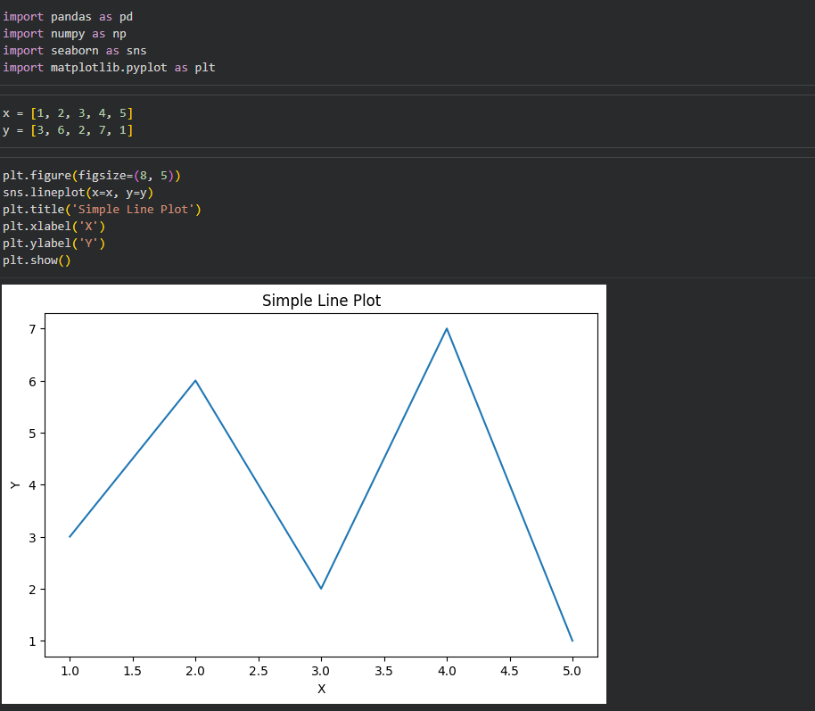

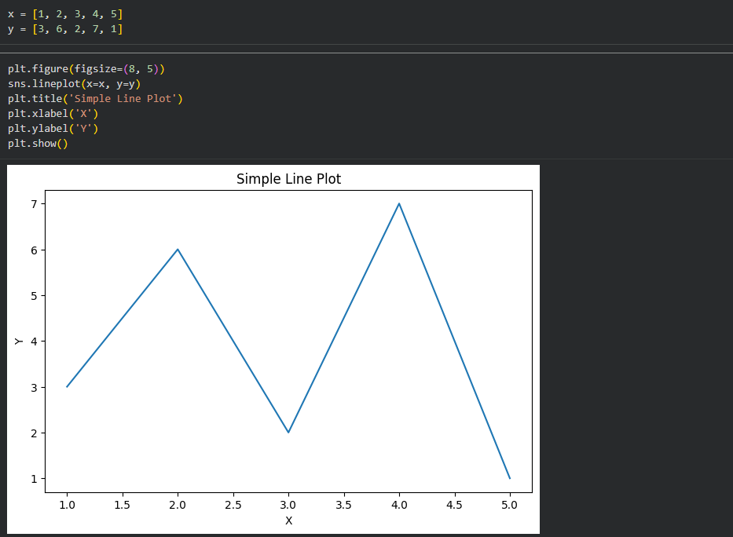

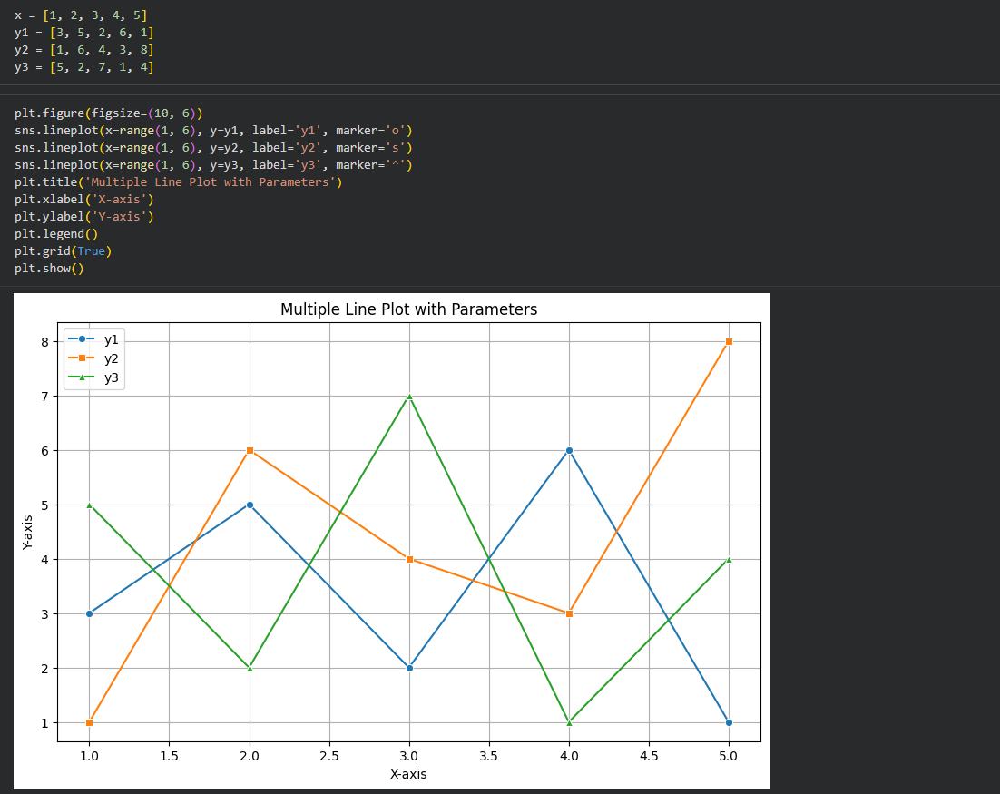

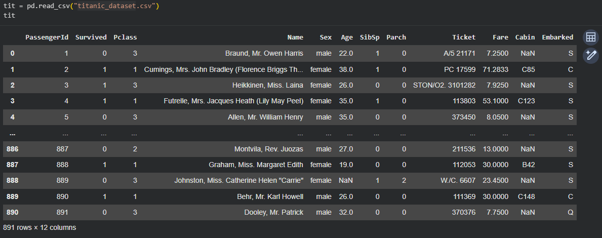

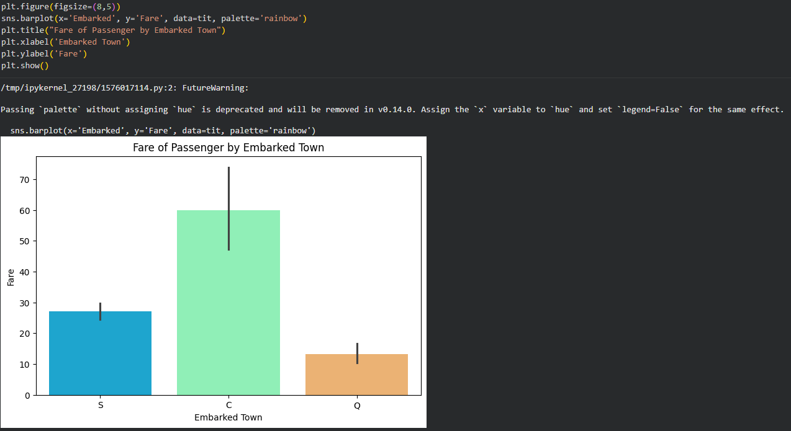

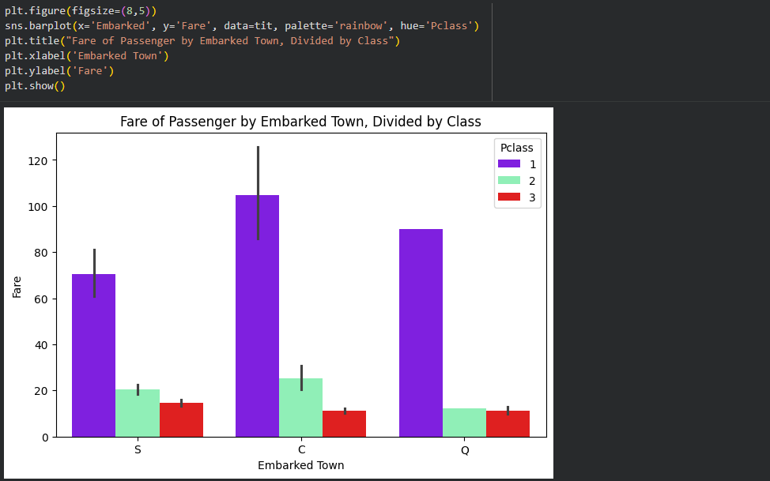

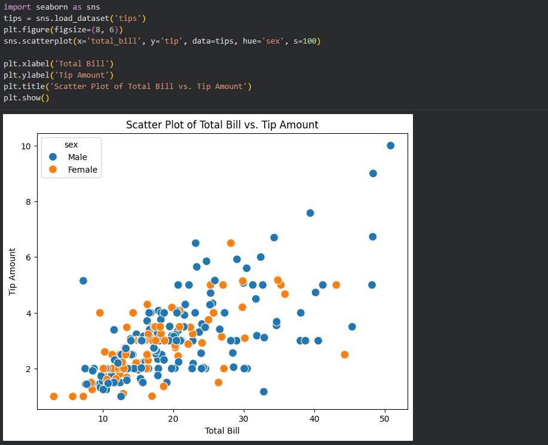

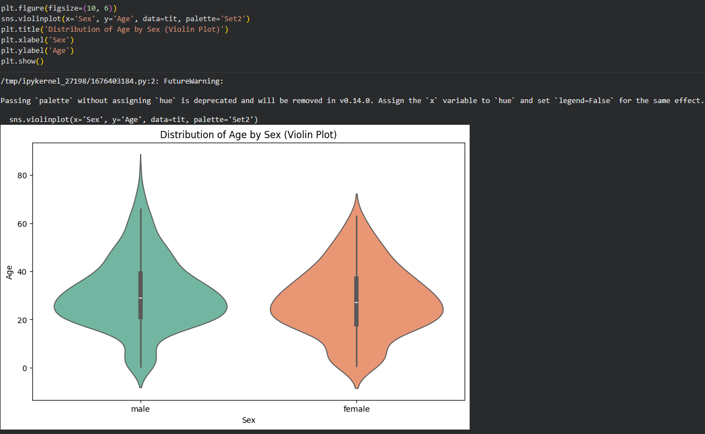

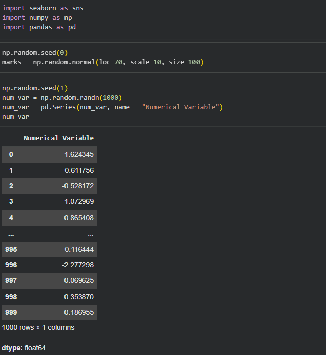

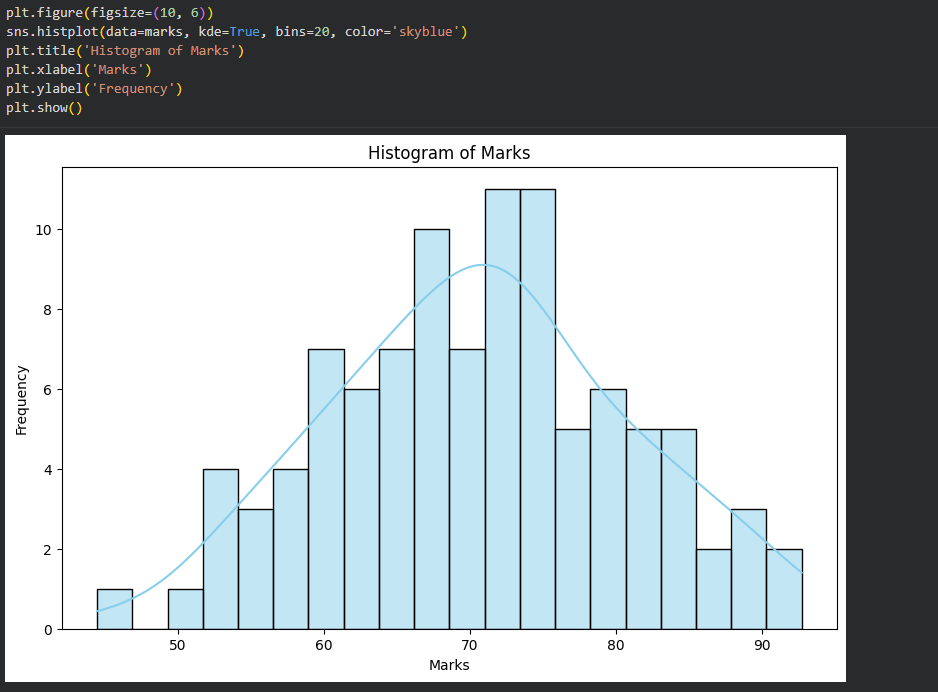

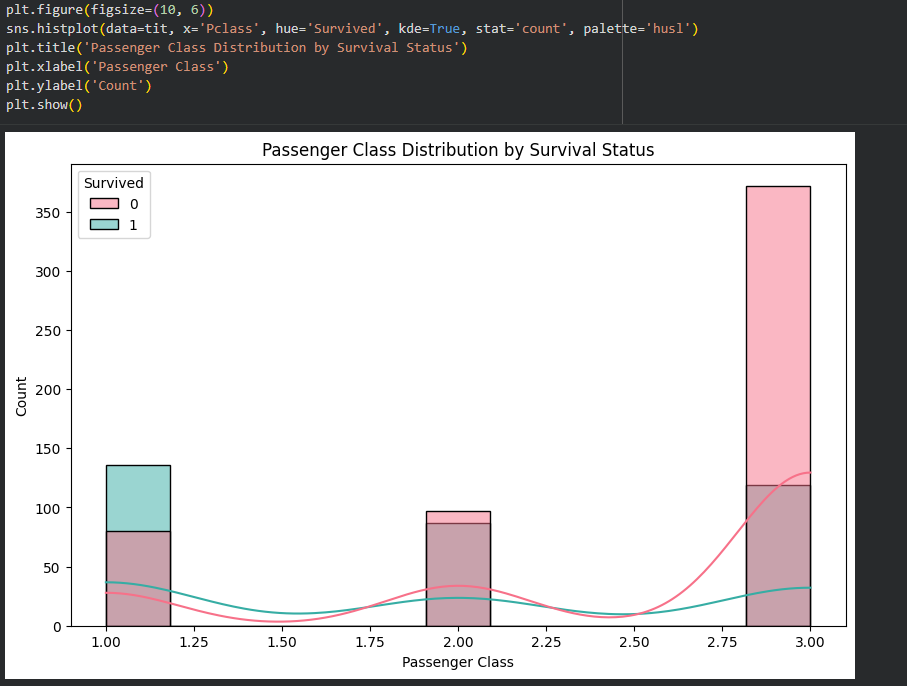

Refer : [Google Collab Link](https://colab.research.google.com/drive/1SdSvd_fJSzsrL839DzHq00SSO4TlityE?usp=sharing)

# Result:

Data Visualization using Seaborn library is implemented and executed successfully.
